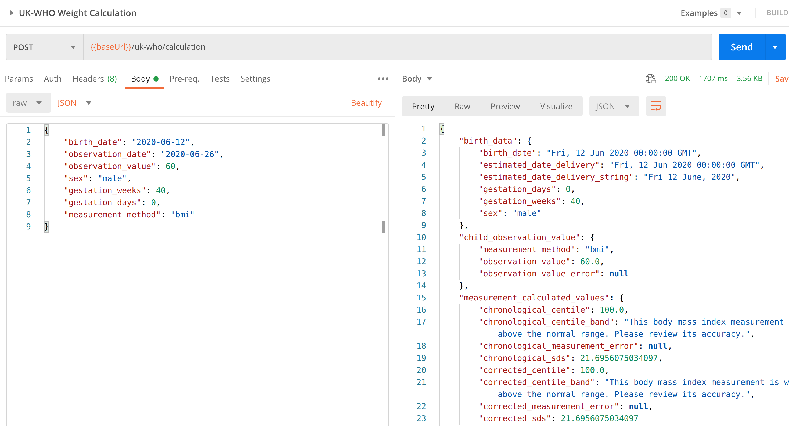

# Server and API Technical Information

:octicons-mark-github-16: [GitHub repository](https://github.com/rcpch/digital-growth-charts-server)

:octicons-code-review-24: [Developer Portal](https://dev.rcpch.ac.uk) (Sign up and get API keys here)  

:material-api: [API Gateway BASEURL](https://api.rcpch.ac.uk) (NB: Without API key will always respond with 404)

## Getting Started

If you want to integrate the RCPCH dGC API into an application, then start [here](../integrator/getting-started.md)

## API details

The API is written in Python. Mathematical and statistical calculations are made using the [SciPy](https://www.scipy.org/) and [NumPy](https://numpy.org/) libraries. Server middleware used is [Flask](https://flask.palletsprojects.com/en/1.1.x/quickstart/), with autogeneration of the openAPI3 specification documents using the Marshmallow plugin for Flask.

We use the Microsoft Azure API Management Platform to handle authorization, rate limits and quotas.