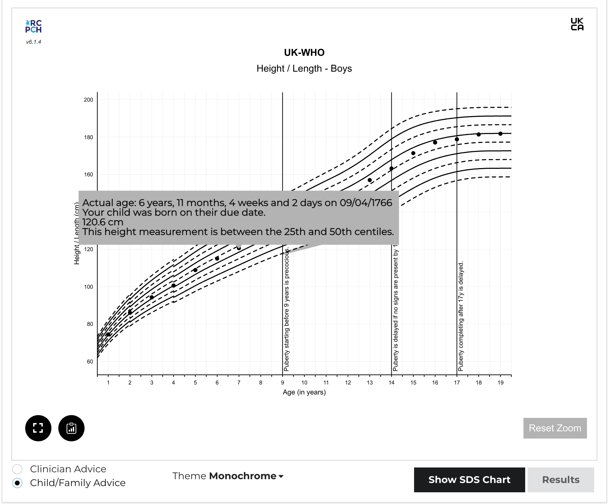

# React Chart Component

Although the process of obtaining a centile/SDS result from the API is very straightforward, rendering this to an actual digital growth chart graphic is quite complex. For this reason, we have produced a permissively-licensed open-source React component, which aims to simplify the process of creating a chart from the chart data received from the API. It makes the job of drawing a vector-graphic centile chart much easier.



:octicons-mark-github-16: [GitHub repository](https://github.com/rcpch/digital-growth-charts-react-component-library)

:material-web: [Demo](https://growth.rcpch.ac.uk/)

You can use the component as-is in a React app, or include it in plain HTML or any other JavaScript framework.

## Why React?


## Getting started

```console
foobar:~foo$ npm i --save @rcph/digital-growth-charts-react-component-library
```

Victory Charts are a dependency (see below), themselves built on top of D3.js. On build it is likely you will get an error relating to circular dependencies for some files in the d3-interpolate module. The is an issue logged [here](https://github.com/d3/d3-interpolate/issues/58).

If you want to run the package locally alongside the react client, there are some extra steps to go through. Since the chart library and the react client both use react, the charts will throw an error if you import them in the ```package.json``` of your app from a folder on your local machine. For example in your react app:

```json
"dependencies": {
    "@rcpch/digital-growth-charts-react-component-library": "file:/Users/FooBar/Development/react/component-libraries/digital-growth-charts-react-component-library",
} 
```

The problem with this is that there are then 2 versions of react running. To overcome this, in your application:

```console
foobar:~foo$ cd node_modules/react
foobar:~foo$ npm link
```

In the root folder of your chart library:

```console
foobar:~foo$ npm link react
```

Repeat the same for ```react-dom``` ensuring all the package versions are the same for your app and the library.
In this way, you can make changes to the chart package and they will appear in your app after ```npm run build``` and refresh your app.

If the invalid hooks error persists inspite of this, a further fix involves deleting the ```node_modules``` folder in the```@rcpch/digital-growth-charts-react-component-library``` folder within ```node_modules``` in the client.

## Structure

This library has been written in Typescript. The main component is `RCPCHChart`, which takes the following `props`:

```js
{
  title: string,
  subtitle: string,
  measurementMethod: 'height' | 'weight' | 'ofc' | 'bmi',
  sex: 'male' | 'female',
  measurementsArray: [Measurement],
  reference: 'uk-who' | 'turner' | 'trisomy-21',
  width: number,
  height: number,
  chartStyle: ChartStyle,
  axisStyle: AxisStyle,
  gridlineStyle: GridlineStyle,
  centileStyle: CentileStyle,
  measurementStyle: MeasurementStyle
}
```

The `Measurement` interface is structured to reflect the JSON `Measurement` object which is returned by the API. The `RCPCHChart` component uses the `reference` prop to determine which chart to render. So far, 3 references are supported: UK-WHO, Turner's Syndrome and Trisomy 21 (Down's Syndrome). The reference data for the centiles are included in the library in plottable format in the `chartdata` folder.

The `Measurement` interface structure is:

```js
interface Measurement {
    birth_data: {
      birth_date: Date,
      estimated_date_delivery: Date,
      estimated_date_delivery_string: string,
      gestation_weeks: number,
      gestation_days: number,
      sex: 'male' | 'female'
    },
    child_observation_value: {
      measurement_method: 'height' | 'weight' | 'bmi' | 'bmi',
      observation_value: number,
      observation_value_error: string
    },
    measurement_dates: {
      chronological_calendar_age: string,
      chronological_decimal_age: number,
      clinician_decimal_age_comment: string
      corrected_calendar_age: string,
      corrected_decimal_age: number,
      corrected_gestational_age: {
        corrected_gestation_weeks: number
        corrected_gestation_days: number
      },
      lay_decimal_age_comment: string,
      observation_date: Date
    },
    measurement_calculated_values: {
      chronological_centile: number,
      chronological_centile_band: string,
      chronological_measurement_error: string,
      chronological_sds: number,
      corrected_centile: number,
      corrected_centile_band: string,
      corrected_measurement_error: string,
      corrected_sds: number
      measurement_method: 'height' | 'weight' | 'bmi' | 'ofc',
    }
    plottable_data: {
      centile_data: {
        chronological_decimal_age_data: {
          age_error: null,
          age_type: "chronological_age" | "corrected_age",
          calendar_age: string,
          centile_band: string,
          clinician_comment: string,
          lay_comment: string,
          observation_error: null,
          observation_value_error: null,
          x: number
          y: number
        },
        corrected_decimal_age_data: {
          age_error: null,
          age_type: "chronological_age" | "corrected_age",
          calendar_age: string,
          centile_band: string,
          clinician_comment: string,
          lay_comment: string,
          observation_error: null,
          observation_value_error: null,
          x: number
          y: number
        }
      },
      sds_data: {
        chronological_decimal_age_data: {
          age_error: null,
          age_type: "chronological_age" | "corrected_age",
          calendar_age: string,
          centile_band: string,
          clinician_comment: string,
          lay_comment: string,
          observation_error: null,
          observation_value_error: null,
          x: number
          y: number
        },
        corrected_decimal_age_data: {
          age_error: null,
          age_type: "chronological_age" | "corrected_age",
          calendar_age: string,
          centile_band: string,
          clinician_comment: string,
          lay_comment: string,
          observation_error: null,
          observation_value_error: null,
          x: number
          y: number
        }
      }
    }
  }
  ```

The styling components allow the user to customise elements of the chart:
Chart styles control the chart and the tooltips

```js
interface ChartStyle{
    backgroundColour?: string, 
    width?: number, 
    height?: number,
    padding?: requires {left?: number, right?: number, top?: number, bottom?: number},
    titleStyle?: requires {name?: string, colour?: string, size?: number, weight?: 'bold' | 'italic' | 'regular'}
    subTitleStyle?: requires {name?: string, colour?: string, size?: number, weight?: 'bold' | 'italic' | 'regular'},,
    tooltipBackgroundColour?: string,
    tooltipStroke?: string,
    tooltipTextStyle?: requires {name?: string, colour?: string, size?: number, weight?: 'bold' | 'italic' | 'regular'}
    termFill?: string,
    termStroke?: string,
    infoBoxFill?: string,
    infoBoxStroke?: string
    infoBoxTextStyle?: requires {name?: string, colour?: string, size?: number, weight?: 'bold' | 'italic' | 'regular'}
    toggleButtonInactiveColour: string // relates to the toggle buttons present if age correction is necessary
    toggleButtonActiveColour: string
    toggleButtonTextColour: string
}
```

Note for the tooltips and infobox text sizes, these are strokeWidths, not point sizes as the text here is svg.

Axis styles control axes and axis labels

```js
interface AxisStyle{
    axisStroke?: string, 
    axisLabelTextStyle?: requires {name?: string, colour?: string, size?: number, weight?: 'bold' | 'italic' | 'regular'}
    tickLabelTextStyle?: requires {name?: string, colour?: string, size?: number, weight?: 'bold' | 'italic' | 'regular'}
}
```

Gridline styles allow/hide gridlines and control line width, presence of dashes, colour.

```js
interface GridlineStyle{
   gridlines?: boolean, 
    stroke?: string, 
    strokeWidth?: number, 
    dashed?: boolean
}
```

Centile styles control the width and colour.

```js
interface CentileStyle{
    centileStroke?: string, 
    centileStrokeWidth?: number, 
    delayedPubertyAreaFill?: string 
}
```

Measurement styles control the plotted data points - colour, size and shape. Corrected ages are always rendered as crosses. Circles for chronological ages are preferred.

```js
interface MeasurementStyle{
    measurementFill?: string, 
    measurementSize?: number // this is an svg size
}
```

At the moment, only standard centile measurement plots are supported, but in future it is expected SDS charts will be added for all references.

In time more props can be added if users request them. If you have requests, please post issues on our [github](https://github.com/rcpch/digital-growth-charts-react-component-library/issues) or contribute.

### Acknowledgements

This Typescript library was built from the starter created by [Harvey Delaney](https://blog.harveydelaney.com/creating-your-own-react-component-library/)
[](https://buildkite.com/harvey/react-component-library)
[](https://opensource.org/licenses/MIT)

The charts are built using [Victory Charts](https://formidable.com/open-source/victory/docs/victory-chart/) for React. We tried several different chart packages for React, but we chose Victory because of their documentation and their ability to customise components.

The chart data bundled in is subject to licence. If you wish to use this software, please contact the RCPCH.

## Background

### Why a Chart library?

In the process of building the API, we realised that it would not be easy for developers not familiar with growth charts to produce them. Even if the API were to send all the values to render centiles and growth measurement points in plottable format (which it does), the challenge of rendering these remains complicated.

For example, charts typically have 9 main centile lines (though there are other formats), each of which can be rendered as a series. However the UK-WHO chart is made of several growth references, each from different datasets, and it is a stipulation that they must not overlap - this means for the four datasets which make up UK-WHO, the developer must render 36 separate 'sections' of centile lines correctly.

Even then, there are certain rules which are key, published by the RCPCH project board. These relate to usability of the charts. For example, the 50th centile should be de-emphasised. These and other rules are listed on the [RCPCH Github](https://github.com/rcpch)

Given the complexity, we decided to create a React component library for developers to use. We designed it to be customisable for those that wanted to use it, but also as a demonstration for developers who wanted to build the charts themselves from the ground up.

If you want to see how the library is implemented, we have built a client for the RCPCHGrowth API in React, which can be found [here](https://github.com/rcpch/digital-growth-charts-react-client).
### Why use React?

React is a popular UI library for Javascript. It has endured well and seems like a popular choice for developers. Importantly, unlike some other Javascript frameworks which are primarily designed for Single Page Applications, React doesn't expect to have the entire webpage to itself. It can be used as a small component in any other web page, even if the main framework being used is something completely different.

!!! question "Tell us what you think"
    Let us know what you think of our design decisions, on this or any other area of the dGC Project, by chatting to us on our [dGC Forum](https://openhealthhub.org/c/rcpch-digital-growth-charts/) :fontawesome-brands-discourse:

### What about other frameworks/UI libraries?

If you need us to develop a charting component in a different language or framework, we may be able to do this with you or your company, however we would need to discuss the requirements and quote for this service. You should be aware that all such RCPCH-developed artefacts will also be open source. We will of course ensure that the licensing of such open source components is compatible with commercial use.

!!! note "Contact us"
    To contact us for this service, email <mailto:commercial@rcpch.ac.uk>

## Contributing

see [Contributing](../developer/contributing.md)

### How to contribute

- Fork the repository to your own GitHub account.

- Set up your development environment (ideally using our instructions here for maximum compatibility with our own development environments)

- Note that running the chart package and react client locally will cause a conflict within react if multiple versions are running. A fix for this can be found in the [react client README.md](https://github.com/rcpch/digital-growth-charts-react-client)

- Ideally, you should have discussed with our team what you are proposing to change, because we can only accept pull requests where there is an accepted need for that new feature or fix.

- We can discuss with you how we would recommend to implement the new feature, for maximum potential 'mergeability' of your PR.

- Once the work is ready to show us, create a pull request on our repo, detailing what the change is and details about the fix or feature. PRs that affect any 'mission critical' part of the code will need suitable tests which we can run.

- We will endeavour to review and merge in a reasonable time frame, but will usually not merge straight into master, rather we will merge into an upcoming release branch.