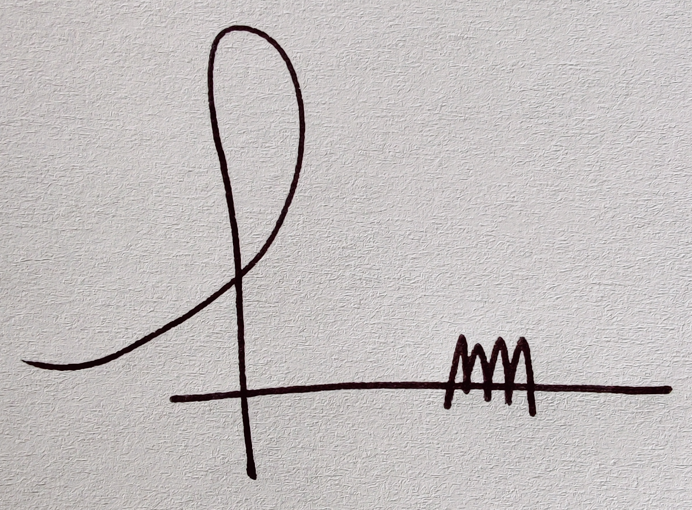

# Declaration of Conformity (API Server)

## EU DECLARATION OF CONFORMITY

1. ### Unique identification of the product

    The Royal College of Paediatrics and Child Health Digital Growth Charts Application Programming Interface **Server**, **Version 1.x.x**

1. ### Name and address of the manufacturer or his authorised representative

    The Royal College of Paediatrics and Child Health (RCPCH), 5-11 Theobalds Road, London, WC1X 8SH (telephone: +44 (0)20 7092 6000).

1. ### This declaration of conformity is issued under the sole responsibility of the manufacturer (or installer)

    The Royal College of Paediatrics and Child Health (RCPCH)

1. ### Object of the declaration (identification of product allowing traceability. It may include a colour image of sufficient clarity to enable the identification of the product, where appropriate.)

    There is no image, this is an entirely software product, with no dedicated hardware.
    Server application code is located at <https://github.com/rcpch/digital-growth-charts-server>

1. ### The object of the declaration described in point 4 is in conformity with the relevant Union harmonisation legislation

    Regulation (EU) 2017/745    Medical Devices

1. ### References to the relevant harmonised standards used, or references to the specifications in relation to which conformity is declared

1. ### Technical file

The complete unabridged technical file, all documentation, instructions for use, and the application source code itself are available publicly within the RCPCH dGC documentation site.

|                             |                                                                     |
| --------------------------- | ------------------------------------------------------------------- |
| Signed for and on behalf of | The Royal College of Paediatrics and Child Health                   |
| Place of Issue              | Cawood, North Yorkshire, UK                                         |
| Date of Issue               | 7th May 2021                                                        |
| Name                        | Dr Marcus Baw                                                       |
| Position                    | Lead Developer, Clinical Safety Officer                             |
| Signature                   |  |

