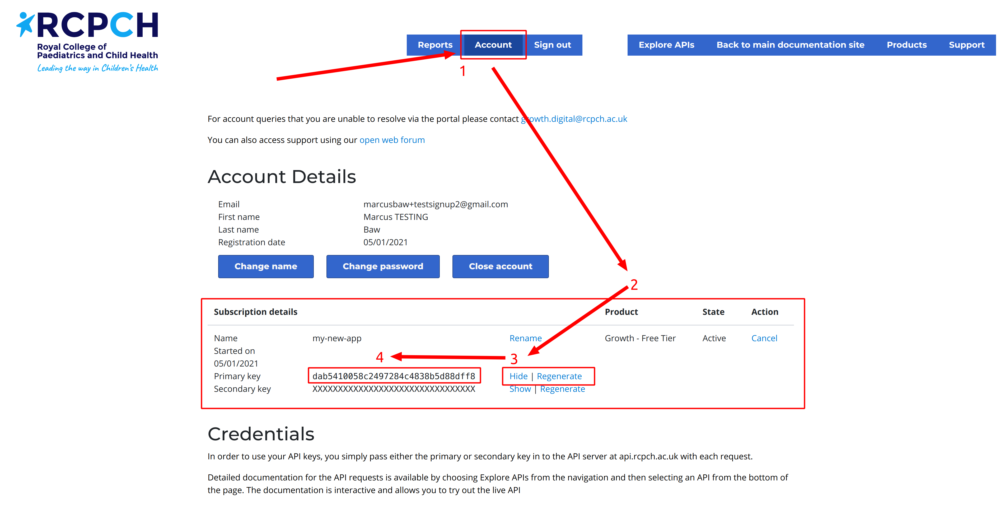

# Getting your Digital Growth Charts API keys

Following on from [Getting Started](../integrator/getting-started.md), where we signed up for the platform and created an application, let's get an API key and start making queries to the API.

## API keys

We require an API key to authenticate calls made and ensure they are valid. The API key allows us to validate your calls are genuine, you have enough **quota** (number of allowed calls per unit time, e.g. 250 calls per month), and you are not exceeding the **rate limit** (number of calls per unit time but over a shorter period, e.g. a maximum of X calls per hour).

!!! danger "API keys are secrets!"
    API keys identify you to the API, so they should be considered *'secrets'*. If someone else can access and use your API keys, then they **are** effectively 'you' as far as our servers are concerned. Therefore, you must keep your API keys private, especially when using keys in a real application.

    The most common cause of accidental API key exposure is inadvertently committing a hard-coded API key to version control, such as Git, and then pushing it to a public site such as GitHub.

    Many stategies are available to help you avoid this. One of the most popular is keeping 'secrets' in Environment Variables and use a [dotenv](https://medium.com/@thejasonfile/using-dotenv-package-to-create-environment-variables-33da4ac4ea8f) tool to manage them.

    *This tutorial is a Node/JavaScript version of `dotenv`, but many other languages are also available.*

## Obtaining API keys in the developer platform

1. Click on the 'Account' menu item to see your developer account.

2. You can see details of each Application created.

3. Click on the 'Show/Hide' link to reveal the actual API key code.

4. Copy this API key for later use.

-----

## Next: [Making an API call](../integrator/making-api-calls.md)
