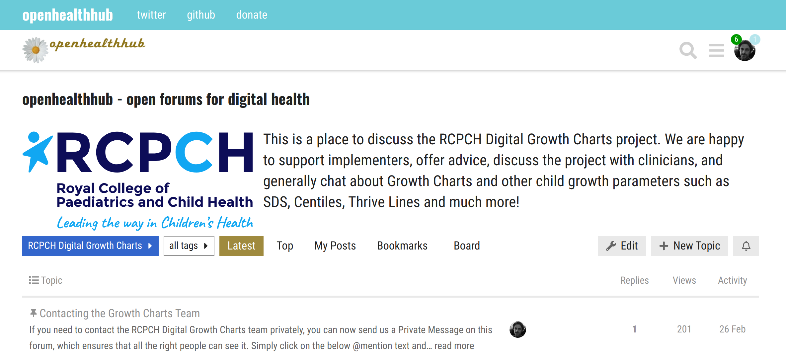

# Support

## Commercial Support

!!! tip "Commercial support"
    For our integration service, which can provide bespoke support to help you integrate the API with your healthcare software solution, please contact <mailto:commercial@rcpch.ac.uk>.

    Please also see our [Pricing](../products/pricing.md) section for more details on the support included with each pricing tier.

To obtain the information you need for the best use of the RCPCH dGC platform depending on your role, please navigate to the appropriate section through the following options:

-   :material-code-tags:{ .lg .middle } __Integrator__

    *I am a developer looking to integrate Digital Growth Charts into an app, EPR, or other existing system.*

    [:octicons-arrow-right-24: Integrators](../integrator/getting-started.md){ .md-button .md-button--primary }

-   :material-stethoscope:{ .lg .middle } __Clinician__

    *I am a clinician wanting to find out more about Digital Growth Charts and how I can get them at my place of work.*

    [:octicons-arrow-right-24: Clinicians](../clinician/faqs-for-clinicians.md){ .md-button .md-button--primary }

-   :fontawesome-brands-github:{ .lg .middle } __Contributor__

    *I want to know how to set up a development environment and start improving the Digital Growth Charts platform.*

    [:octicons-arrow-right-24: Contributors](../developer/start-here.md){ .md-button .md-button--primary }

-   :material-safety-goggles:{ .lg .middle } __Clinical Safety Officer__

    *I'm a Clinical Safety Officer looking for DCB0129 and other compliance information.*

     
    [:octicons-arrow-right-24: Clinical Safety Management File](../safety/overview.md){ .md-button .md-button--primary }

## Free Support

### Discourse Forum

Our primary support method is through the forum at [openhealthhub.org](https://openhealthhub.org/c/rcpch-digital-growth-charts). You can search for previous answers to your question, connect with the developers and team behind the API, and find a community of other integrators, with whom you can share tips and ideas.

[Go to the forums :fontawesome-brands-discourse:](https://openhealthhub.org/c/rcpch-digital-growth-charts){ .md-button .md-button--primary }

### Signal Chat

RCPCH have set up a Signal group chat for the Digital Growth Charts. This is a useful way to get quick answers and signposting to the right documentation, whether you're stuck, found an issue or have any other reason to speak with the developer team directly.

[Go to the Signal group :simple-signal:](https://signal.group/#CjQKIAjLf5lS9OZIAI6lsJKWP1LmeJXkUW_fzZH1ryEw3oFEEhBH-4F7WnlyYjKerjfzD6B0){ .md-button .md-button--primary }

-----
