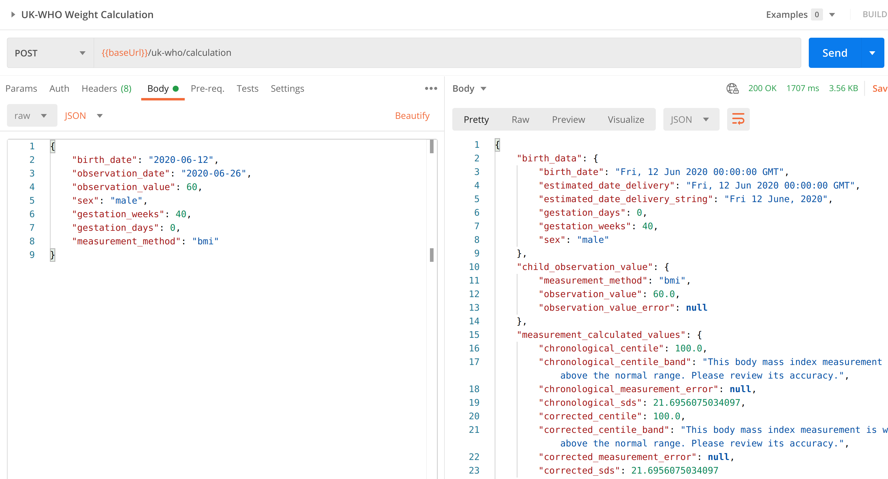



<!-- Zenodo citation link -->

[](https://god.gw.postman.com/run-collection/202702-d1daf1c6-3a4c-469d-be2a-e2fcf3d84090?action=collection%2Ffork&collection-url=entityId%3D202702-d1daf1c6-3a4c-469d-be2a-e2fcf3d84090%26entityType%3Dcollection%26workspaceId%3Dd868b72e-0677-4b67-9283-112363b1f5ac#?env%5BLIVE%20api.rcpch.ac.uk%5D=W3sia2V5IjoiYmFzZVVybCIsInZhbHVlIjoiaHR0cHM6Ly9hcGkucmNwY2guYWMudWsvZ3Jvd3RoL3YxIiwiZW5hYmxlZCI6dHJ1ZSwidHlwZSI6ImRlZmF1bHQiLCJzZXNzaW9uVmFsdWUiOiJodHRwczovL2FwaS5yY3BjaC5hYy51ay9ncm93dGgvdjEiLCJzZXNzaW9uSW5kZXgiOjB9LHsia2V5IjoiYXBpS2V5IiwidmFsdWUiOiJJTlNFUlRfWU9VUl9BUElfS0VZX0hFUkUiLCJlbmFibGVkIjp0cnVlLCJ0eXBlIjoic2VjcmV0Iiwic2Vzc2lvblZhbHVlIjoiSU5TRVJUX1lPVVJfQVBJX0tFWV9IRVJFIiwic2Vzc2lvbkluZGV4IjoxfV0=)

[:octicons-mark-github-16: GitHub repository](https://github.com/{{ repository_name }})

[:octicons-code-review-24: Developer Portal](https://dev.rcpch.ac.uk) (Sign up and get API keys here)

[:material-api: API Gateway Base URL](https://api.rcpch.ac.uk) (NB: Without a valid API key, the endpoint will always respond with 404)

## Getting Started with integrating our API

If you want to integrate the RCPCH Digital Growth Charts API into an application, then start [here](../integrator/getting-started.md).
