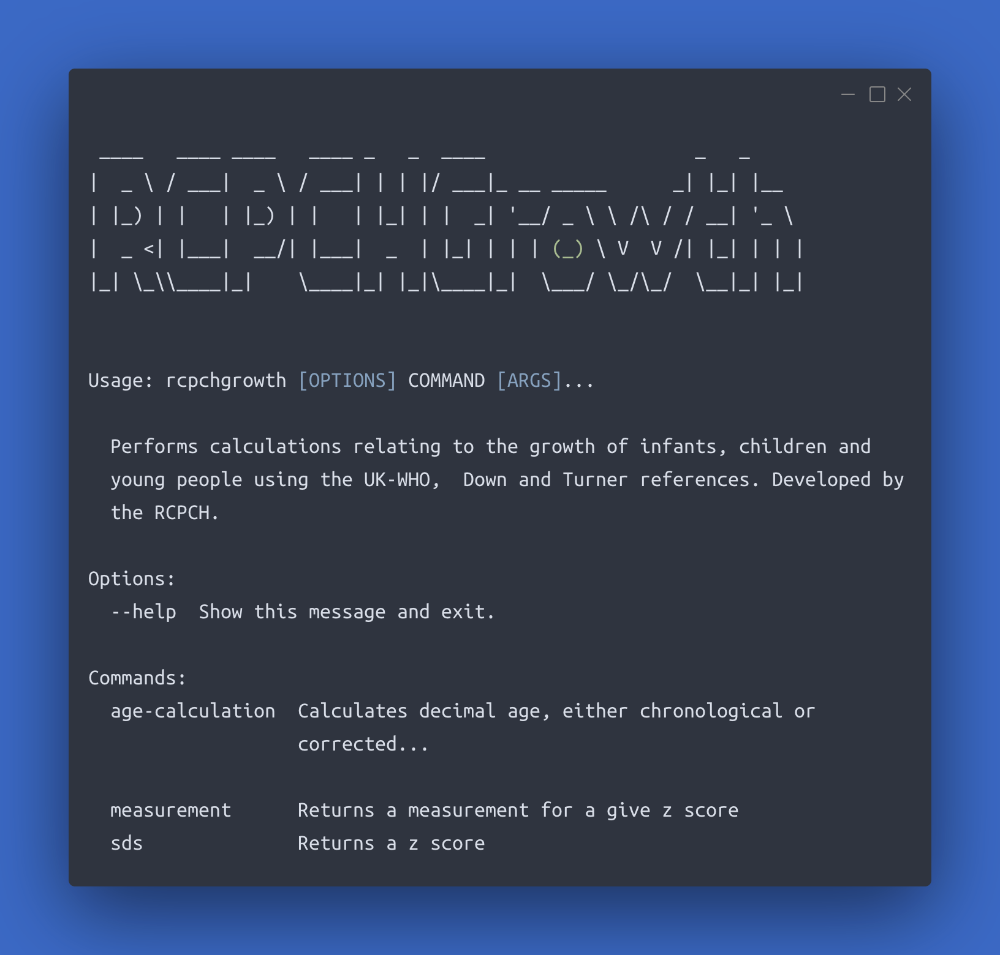



[](https://github.com/{{ repository_name }}/issues)
[](https://github.com/{{ repository_name }}/stargazers)
[](https://github.com/{{ repository_name }}/network/members)
[](https://github.com/{{repository_name }}/blob/live/LICENSE)
[](https://github.com/rcpch/rcpchgrowth-python-cli/actions/workflows/python-publish.yml)

[:octicons-mark-github-16: GitHub repository](https://github.com/{{ repository_name }})

Partly for our own uses, we've wrapped the [RCPCHGrowth Python package](python-library.md) in a command-line tool, so you can conveniently use the powerful growth functions in `rcpchgrowth-python` in the terminal.



## Installation

Use `pip` to install the CLI tool:

```console
pip install rcpchgrowth-python-cli
```

## Usage

Check `rcpchgrowth-python-cli` was correctly installed. The following command should return help text:

```console
rcpchgrowth --help
```

### Calculating decimal chronological age

The `age-calculation` function returns a decimal age representing the difference between 2 dates:

```console
rcpchgrowth age-calculation [birth_date] [observation_date] [gestation_weeks] [gestation-days] [-a --adjustment]
```

For example:

```console

>>> rcpchgrowth age-calculation 2005-02-17 2023-02-17 39 4 -a

Calculates decimal age, either chronological or corrected for gestation if the adjustment flag is true. Params: birth_date, observation_date, gestation_weeks, gestation_days
Adjusted: 17.99041752224504 y,
17 years, 11 months and 4 weeks
```

#### Parameters

- `birth_date` **(required)**: format `YYYY-MM-DD`
- `observation_date` **(required)**: format `YYYY-MM-DD`
- `gestation_weeks` *(optional)*: an integer, default `40`
- `gestation_days` *(optional)*: an integer, default `0`
- `-a` or `--adjustment` *(optional)*: if passed, the age will be returned, corrected for gestational age

Note: the command line will usually error if a leading 0 is supplied.

#### Gestational Age Correction

If the `-a` or `--adjustment` flags are passed, gestational age correction will be performed to the supplied gestation in weeks and days.

If nothing is passed, then gestational age correction will still be applied, but it will use the default 40+0 weeks.

#### Examples

The following calculates a decimal age for a child born on 10th October 1759 and measured on 12th November 1759, with gestational age correction for birth at 28 weeks 2 days:

```console
rcpchgrowth age-calculation 1759-10-10 1759-11-12 28 2 -a
```

Below is the same calculation *without* gestational age correction:

```console
rcpchgrowth age-calculation 1759-10-10 1759-11-12 28 2
```

### Generating measurements fitting a certain SDS

The `measurement-for-sds` function returns a measurement for an SDS:

```console
rcpchgrowth measurement-for-sds [decimal_age] [measurement_method] [sex] [observation_value] [-r --reference]
```

#### Parameters

Note: these are argument-order sensitive.

- `decimal_age` **(required)**: a float
- `measurement_method` **(required)**: a string, one of `'height'`, '`weight`', `'bmi'` (Body Mass Index) or `'ofc'` (head circumference)
- `sex` **(required)**: a string, one of `'male'` or `'female'`
- `observation_value` **(required)**: a float
- `-r` or `--reference` *(optional)*: a string, default is `'uk-who'`. Other options include `'trisomy-21'` or `'turners-syndrome'`

#### Example

```console
>>> rcpchgrowth measurement-for-sds 8.3 height female 0.72 --reference turners-syndrome

Reference: Turner Syndrome
SDS 0.72
Centile: 76.424 %
height: 115.79078818040003 cm
```

### Generating SDS for a measurement

The `sds-for-measurement` function returns an SDS for a measurement:

```console
rcpchgrowth sds-for-measurement [decimal_age] [measurement_method] [sex] [observation_value] [-r --reference]
```

#### Parameters

Note: these are argument-order sensitive.

- `decimal_age` **(required)**: a float
- `measurement_method` **(required)**: a string, one of `'height'`, '`weight`', `'bmi'` (Body Mass Index) or `'ofc'` (head circumference)
- `sex` **(required)**: a string, one of `'male'` or `'female'`
- `observation_value` **(required)**: a float
- `-r` or `--reference` *(optional)*: a string, default is `'uk-who'`. Other options include `'trisomy-21'` or `'turners-syndrome'`

#### Example

```console
>>> rcpchgrowth sds-for-measurement 16.3 ofc female 55

Reference: UK-WHO
SDS: -0.27811780457145885
Centile: 39.0 %
```

### Generating measurements for a centile

The `measurement-for-centile` function returns a measurement for a centile:

```console
rcpchgrowth sds-for-measurement [decimal_age] [measurement_method] [sex] [centile] [-r --reference]
```

#### Parameters

Note: these are argument-order sensitive.

- `decimal_age` **(required)**: a float
- `measurement_method` **(required)**: a string, one of `'height'`, '`weight`', `'bmi'` (Body Mass Index) or `'ofc'` (head circumference)
- `sex` **(required)**: a string, one of `'male'` or `'female'`
- `centile` **(required)**: a float
- `-r` or `--reference` *(optional)*: a string, default is `'uk-who'`. Other options include `'trisomy-21'` or `'turners-syndrome'`

#### Example

```console
>>> rcpchgrowth measurement-for-centile 3.4 weight male 25.0 --reference trisomy-21

Reference: Trisomy 21/Down's Syndrome
SDS -0.674
Centile: 25.0 %
weight: 12.367721906931306 kg
```

## Development of the CLI tool

If you want to contribute to development of the CLI tool, please see [Developing the RCPCH CLI Tool](../developer/rcpchgrowth-cli.md).
