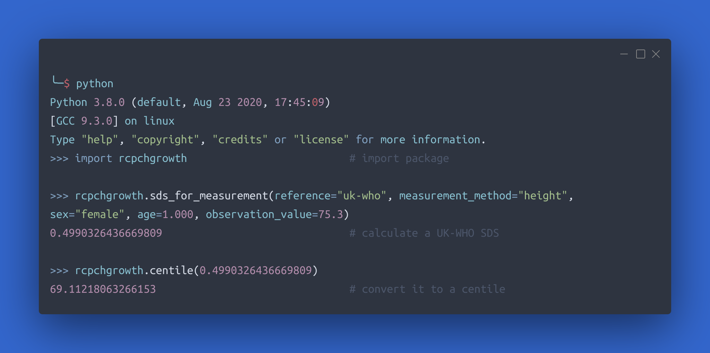



[](https://github.com/{{ repository_name }}/issues)
[](https://github.com/{{ repository_name }}/stargazers)
[](https://github.com/{{ repository_name }}/network/members)
[](https://github.com/{{repository_name }}/blob/live/LICENSE)
[](https://github.com/{{ repository_name }}/actions/workflows/main.yml)
[](https://zenodo.org/badge/latestdoi/361149103)

[:octicons-mark-github-16: GitHub Repository](https://github.com/rcpch/rcpchgrowth-python)

[:fontawesome-brands-python: PyPi Package](https://pypi.org/project/rcpchgrowth/)

The calculation functions within the Digital Growth Charts API are powered by a self-contained Python package extracted out into a separate repository and published on [PyPi](https://pypi.org/project/rcpchgrowth/) (the Python Package Index). This enables the centile calculation functions to be used in other programs.



## Installation

To add the `rcpchgrowth` package to your project, install via `pip`

``` bash
pip install rcpchgrowth
```

## License

We have taken the slightly unusual step of licensing the python package under the [GNU Affero General Public License version 3](https://opensource.org/licenses/AGPL-3.0), which may restrict commercial reuse models. This is because all the 'heavy lifting' of the API server depends on this package. We wanted to protect from 'unofficial' commercial competing APIs, at least until the model of Royal College-delivered APIs is established and secure.

!!! tip "Helpful licensing"
    If this licensing issue restricts your valid, patient-benefiting, non-profit use-case, then please do reach out to us. We will consider dual-license options or some other arrangement that helps you.

## Feedback

We'd be interested to hear from people who are using the RCPCHGrowth Python package, so we can learn more about the use-cases and how we might continue to improve the package. Please do [create issues on our GitHub repo](https://github.com/rcpch/rcpchgrowth-python/issues), or discuss the package in the [dGC Forums](https://forum.rcpch.tech/)

## Contributing

If you want to contribute to the project, please read the section on [Contributing](/docs/developer/contributing.md).
