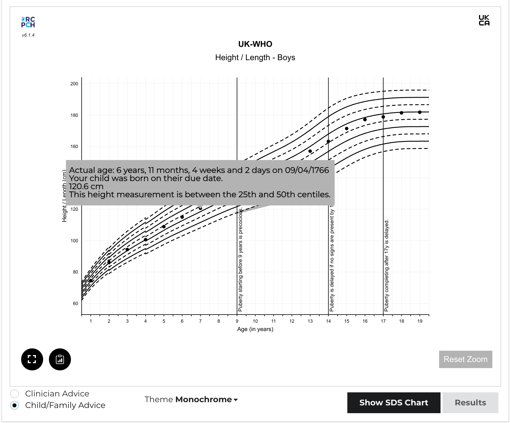

# React Chart Component


[:octicons-mark-github-16: GitHub repository](https://github.com/{{ repository_name }})

[:material-web: Online Demo](https://growth.rcpch.ac.uk/)

## Features

* Calculation and display of height, weight, BMI, head circumference, and BMI centiles.
* Support for Trisomy 21 (Down syndrome) and Turner syndrome.
* Automatic gestational age correction, throughout the life course.
* Zoomable, scrollable charts.
* Event logging - clinical events can be associated with measurements.
* Bone age integration.
* Mid-parental heights with mid-parental centile lines (at +2 and -2 SDS).
* SDS (Standard Deviation Score) charts.
* Decimal age support.
* Customisable chart colours.
* Save chart image to clipboard.
* Tooltip information which can be optimised for clinicians or families.
* 'Whole Life Course' toggle to view only measurements or whole chart.



You can use the component as-is in a React app, or include it in plain HTML or any other JavaScript framework.

## Supported Features

* Corrected/Chronological age with toggle
* Zoom with zoom reset (optional prop)
* Event logging - events associated with measurements
* Bone ages
* Mid-parental heights with mid-parental centile lines (at +2 and -2 SDS)

### Version 7 new features

* Update to react 18.2
* Centile label toggle
* React testing with Jest
* Deprecate styles in favour of themes (custom theme can be supplied)

### Version 6 new features

* Rework the data structure to match that from API to prevent persisting data in the component in future
* BMI SDS lines
* SDS charts
* Save to clipboard

### New in 6.1

* Dates included in tooltips
* `clinicianFocus` (optional prop) to toggle between advice strings aimed at clinicians or those aimed at families / children & young people
* Toggle button to allow user to constrain viewable chart to measurements or view the whole chart

## Background

### Why a Chart library?

In the process of building the API, we realised the difficulty for developers unfamiliar with growth charts to produce one acceptable to clinicians.

For example, charts typically have 9 main centile lines (though there are other formats), each of which can be rendered as a series. However, the UK-WHO chart is made of several growth references, each from different datasets, and it is a stipulation that they must not overlap. This means that for the four datasets which make up UK-WHO, the developer must render 36 separate 'sections' of centile lines, marrying them up correctly.

Even then, there are certain rules which are key, published by the RCPCH project board. These relate to usability of the charts. For example, the 50th centile should be de-emphasised. These and other rules are listed on the [Client Specification](../integrator/client-specification.md).

Given the complexity, we decided to create a React component library for developers to use. We designed it to be customisable for direct use, but also as a demonstration for developers wanting to build the charts from the ground up.

For this reason, we have produced a permissively-licensed, open-source React component, which aims to simplify the process of creating a chart from the chart data received from the API. It makes the job of drawing a vector-graphic centile chart much easier.

If you want to see how the library is implemented, we have built a full client for the RCPCHGrowth API in React, which uses this component library, and can be found [here](https://github.com/rcpch/digital-growth-charts-react-client).

### Why use React?

React is a popular UI library for Javascript. It has endured well and seems like a popular choice for developers. Importantly, unlike some other Javascript frameworks which are primarily designed for Single Page Applications, React doesn't expect to have the entire webpage to itself. It can be used as a small component in any other web page, even if the main framework being used is completely different.

!!! question "Tell us what you think"
    Let us know what you think of our design decisions, on this or any other area of the dGC Project, by chatting to us on our [dGC Forum](https://forum.rcpch.tech/) :fontawesome-brands-discourse:.

### What about other frameworks/UI libraries?

If you need us to develop a charting component in a different language or framework, we may be able to do this with you or your company. We would need to discuss the requirements and quote for this service. You should be aware that all such RCPCH-developed artefacts will also be open source. We ensure the licensing of open source components is compatible with commercial use.

!!! note "Contact us"
    To contact us for this service, email <mailto:commercial@rcpch.ac.uk>.

## Getting started

```console
npm i --save @rcpch/digital-growth-charts-react-component-library
```

### Circular import errors

Victory Charts are a dependency (see below), built on top of D3.js. On build, it is likely you will get an error relating to circular dependencies for some files in the d3-interpolate module. This issue is logged [here](https://github.com/d3/d3-interpolate/issues/58).

### Running the Charts Package locally

To run the package locally alongside the React client, there are some extra steps. Since the Chart library and the React client both use React, the Charts will throw an error if you import them in the ```package.json``` of your app from a folder on your local machine.

To develop the charts you can use Storybook:
`npm run storybook`

or to run the client and charts together:

1. in the root of the chart library: `npm link`
2. in the root of the client: `npm link @rcpch/digital-growth-charts-react-component-library`
3. Note that you need to be running the same version of node (>=20) in both consoles for this symlink to work
4. If you get a 'hooks error' on running the client, delete react and react-dom from the node_modules folder in the library. Note you will need to reinstall it if you later run storybook.
5. For changes to appear in the client, in the library console: `npm run build`

## Structure

This library has been written in Typescript. The main component is `RCPCHChart`, which takes the following `props`. Note that each component will only render a single chart type, so if you wanted to render a weight *and* a height chart, these must be done as two separate instances of the component.

### RCPCHChart component

## Props

The prop to define which chart type is rendered is: `chartType?: 'centile' | 'sds'`

Other props are:

-   `title: string;` the title of the chart : could include patient name and identifiers
-   `measurementMethod: 'height' | 'weight' | 'ofc' | 'bmi';` _must_ be one of the options provided
-   `reference: 'uk-who' | 'turner' | 'trisomy-21';` _must_ be one of the options provided
-   `sex: 'male' | 'female';` _must_ be one of the options provided
-   `measurements: { measurementMethod: Measurement[]};` array of measurements returned from RCPCH Growth API. This should not be edited or manipulated. **NOTE this has changed in v7.0.0**
-   `midParentalHeightData?: MidParentalHeightObject | undefined;` an RCPCH object returned from the RCPCH Growth API. Should not be edited or manipulated
-   `enableZoom?: boolean;` Allows the user to zoom and pan the charts if set to true. If disabled, hides the buttons associated with this.
-   `chartType?: 'centile' | 'sds';` These are addressed below
-   `enableExport?: boolean | undefined;` Cut/Paste button. Returns an SVG snapshot of the chart (without title) if set to true. If false, the buttons associated with this are hidden.
-   `exportChartCallback(svg?: any): any;` Names the function within the client to return the exported SVG to.
-   `clinicianFocus?: boolean | undefined | null;` Toggles tooltip advice between those aimed at clinicians and those more appropriate for patients/lay people.
-   `theme?: 'monochrome' | 'traditional' | 'tanner1' | 'tanner2' | 'tanner3' | 'custom'`
-   `customThemeStyles?`: discussed below

### `measurements`

**Note in v7.0.0 this prop has changed**. Formerly `measurementsArray`, the structure has changed to conform to the following structure:

```js
{
    height?: Measurement[]
    weight?: Measurment[]
    bmi?: Measurement[]
    ofc?: Measurement[]
}
```

Measurements should be passed to the component through the `measurements` prop using this structure.

This aligns the SDS and centile charts to accept the same structure. SDS and centile charts differ,
in that SDS charts multiple measurement methods on a single chart, whereas centile charts must have one instance for each measurement method.

#### Example

An array of height measurements for a girl returned from the RCPCH Growth API:

```js
<RCPCHChart
    reference={'uk-who'}
    measurementMethod={'height'}
    sex={'female'}
    title={"Arthur Scargill - 12345678A"}
    measurements={
        height: [
            {
                birth_data: {
                    ...
                },
                bone_age: {
                    ...
                },
                child_observation_value: {
                    ...
                },
                events_data: {
                    ...
                },
                measurement_calculated_values: {
                    ...
                },
                measurement_dates: {
                    ...
                },
                plottable_data: {
                    ...
                }
            },
            ...
        ]
    } // this is the plottable child data
    midParentalHeightData={[]} // this is the optional plottable midparental height data from the RCPCH API
    theme={'traditional'}
    enableZoom
    chartType={'centile'}
    enableExport={false}
    exportChartCallback={()=>{}} // this is a callback for the export chart function if true
    clinicianFocus={false}
/>
```

In the same way, an implementation for the sds charts would be:

```js
<RCPCHChart
    reference={'uk-who'}
    measurementMethod={'height'}
    sex={'female'}
    title={"Arthur Scargill - 12345678A"}
    measurements={
        height: [
            {
                birth_data: {
                    ...
                },
                bone_age: {
                    ...
                },
                child_observation_value: {
                    ...
                },
                events_data: {
                    ...
                },
                measurement_calculated_values: {
                    ...
                },
                measurement_dates: {
                    ...
                },
                plottable_data: {
                    ...
                }
            },
            ...
        ],
        weight: [
            {
                birth_data: {
                    ...
                },
                bone_age: {
                    ...
                },
                child_observation_value: {
                    ...
                },
                events_data: {
                    ...
                },
                measurement_calculated_values: {
                    ...
                },
                measurement_dates: {
                    ...
                },
                plottable_data: {
                    ...
                }
            },
            ...
        ],
        ofc: [],
        bmi: []
    } // this is the plottable child data
    midParentalHeightData={[]} // this is the optional plottable midparental height data from the RCPCH API
    theme={'traditional'}
    enableZoom
    chartType={'sds'}
    enableExport={false}
    exportChartCallback={()=>{}} // this is a callback for the export chart function if true
    clinicianFocus={false}
/>
```

For information the structure of the Measurement interface is provided here. This matches the response object from the RCPCH Growth API, therefore implementers should not need to use this interface:

```js
export interface Measurement {
    birth_data: {
        birth_date: string;
        estimated_date_delivery: string;
        estimated_date_delivery_string: string;
        gestation_weeks: number;
        gestation_days: number;
        sex: 'male' | 'female';
    };
    child_observation_value: {
        measurement_method: 'height' | 'weight' | 'bmi' | 'ofc';
        observation_value: number;
        observation_value_error?: string;
    };
    measurement_dates: {
        chronological_calendar_age: string;
        chronological_decimal_age: number;
        corrected_calendar_age: string;
        corrected_decimal_age: number;
        corrected_gestational_age?: {
            corrected_gestation_weeks?: number;
            corrected_gestation_days?: number;
        };
        comments?:{
            clinician_corrected_decimal_age_comment?: string;
            lay_corrected_decimal_age_comment?: string;
            clinician_chronological_decimal_age_comment: string;
            lay_chronological_decimal_age_comment: string;
        }
        observation_date: string;
        corrected_decimal_age_error?: string;
        chronological_decimal_age_error?: string;
    };
    measurement_calculated_values: {
        chronological_centile: number;
        chronological_centile_band: string;
        chronological_measurement_error?: string;
        chronological_sds: number;
        corrected_centile: number;
        corrected_centile_band: string;
        corrected_measurement_error?: string;
        corrected_percentage_median_bmi?: number
        chronological_percentage_median_bmi?: number
        corrected_sds: number;
    };
    plottable_data: {
        centile_data: {
            chronological_decimal_age_data: {
                age_error?: string;
                age_type: 'chronological_age' | 'corrected_age';
                calendar_age: string;
                centile_band: string;
                clinician_comment: string;
                lay_comment: string;
                observation_error?: string;
                observation_value_error?: string;
                x: number;
                y: number;
                b?: number;
                centile?: number;
                sds?: number;
                bone_age_label?: string;
                events_text?: string[];
                bone_age_type?: string;
                bone_age_sds?: number;
                bone_age_centile?: number;
            };
            corrected_decimal_age_data: {
                age_error?: string;
                age_type: 'chronological_age' | 'corrected_age';
                calendar_age: string;
                centile_band: string;
                clinician_comment: string;
                lay_comment: string;
                observation_error?: string;
                observation_value_error?: string;
                x: number;
                y: number;
                b?: number;
                centile?: number;
                sds?: number;
                bone_age_label?: string;
                events_text?: string[];
                bone_age_type?: string;
                bone_age_sds?: number;
                bone_age_centile?: number;
                corrected_gestational_age?: string;
            };
        };
        sds_data: {
            chronological_decimal_age_data: {
                age_error?: string;
                age_type: 'chronological_age' | 'corrected_age';
                calendar_age: string;
                centile_band: string;
                clinician_comment: string;
                lay_comment: string;
                observation_error?: string;
                observation_value_error?: string;
                x: number;
                y: number;
                b?: number;
                centile: number;
                sds: number;
                bone_age_label?: string;
                events_text?: string[];
                bone_age_sds?: number;
                bone_age_type?: string;
                bone_age_centile?: number;
            };
            corrected_decimal_age_data: {
                age_error?: string;
                age_type: 'chronological_age' | 'corrected_age';
                calendar_age: string;
                centile_band: string;
                clinician_comment: string;
                lay_comment: string;
                observation_error?: string;
                observation_value_error?: string;
                x: number;
                y: number;
                b?: number;
                centile: number;
                sds: number;
                bone_age_label?: string;
                bone_age_type?: string;
                events_text?: string[];
                bone_age_sds?: number;
                bone_age_centile?: number;
                corrected_gestational_age?: string;
            };
        };
    };
    bone_age: {
        bone_age?: number;
        bone_age_type?: string;
        bone_age_centile?: number;
        bone_age_sds?: number;
        bone_age_text?: string;
    };
    events_data: {
        events_text?: string[];
    };
}
```

### `enableZoom`

```enableZoom```: a boolean optional prop which defaults to false. If true, the user can press and mouse click to zoom in or out once measurements are being displayed. A reset zoom button also appears.

### `chartType`

```chartType```: a string mandatory prop and must be one of ```'centile' | 'sds'```. It toggles between centile and SDS charts.

### `enableExport`

```enableExport```: a boolean optional prop, defaults to false. If true, ```exportChartCallback``` must be implemented and a copy-paste button is rendered below the chart.

### `exportChartCallBack`

```exportChartCallback``` callback function implemented if `enableExport` is true. It receives an SVG element. This can be saved in the client to clipboard by converting to canvas using HTML5. An example implementation of this is [here](https://github.com/rcpch/digital-growth-charts-react-client/blob/live/src/functions/canvasFromSVG.js) in our demo client.

### `clinicianFocus`

```clinicianFocus```: a boolean optional prop which defaults to false. If true, the advice strings that are reported to users in tooltips are more technical and aimed at clinicians familiar with centile charts. If false, the advice strings will be less technical and more suitable for parents, guardians, carers or other laypersons.

!!! example "Requests for additional functionality in props"
    In time, more props can be added if users request them. If you have requests, please post issues on our [GitHub](https://github.com/rcpch/digital-growth-charts-react-component-library/issues) or get involved to contribute as below.

### Themes vs Styles

Themes are collections of styles. The RCPCH have created some suggested themes:

1. Monochrome (default)
2. Traditional: this uses the preexisting pink and blue colours present on the paper charts
3. Tanner 1: Purple and yellow
4. Tanner 2: Orange and blue
5. Tanner 3: Red and yellow
6. Custom

These themes all have predefined attributes for `fontFamily`, `color`, `size`, `stroke` and `strokeWidth` for different aspects of the charts.
If these attributes are too prescriptive and users would like either to build their own theme,
or override styles within an existing theme, this can be done by passing in custom styles through the `customThemeStyles` prop.

All attributes are optional, therefore only those attributes where changes are requested need be passed in. The keys for the `customThemeStyles` object are as follows:

-   `chartStyle?: ChartStyle;`
-   `axisStyle?: AxisStyle;`
-   `gridlineStyle?: GridlineStyle;`
-   `centileStyle?: CentileStyle;`
-   `sdsStyle?: SDSStyle;`
-   `measurementStyle?: MeasurementStyle;`

The attributes of each of these are below:

#### `ChartStyle`

-   `backgroundColour?: string;` //background colour of chart
-   `titleStyle?: TextStyle `| undefined; // style of text in title: includes fontFamily, fontSize, colour, weight (regular/bold/italic)
-   `subTitleStyle?: TextStyle `| undefined; // style of text in subtitle: includes fontFamily, fontSize, colour, weight (regular/bold/italic)
-   `tooltipBackgroundColour?: string;` //background colour of tooltip
-   `tooltipStroke?: string;` //border colour of tooltip
-   `tooltipTextStyle?: TextStyle `| undefined; // tooltip text: includes fontFamily, fontSize, colour, weight (regular/bold/italic)
-   `termFill?: string;` // background colour of weight term area
-   `termStroke?: string;` // border colour of weight term area
-   `toggleButtonInactiveColour?: string;` // buttons - inactive colour
-   `toggleButtonActiveColour?: string;` // buttons - active colour
-   `toggleButtonTextStyle?: TextStyle | undefined;` // buttons text: includes fontFamily, fontSize, colour, weight (regular/bold/italic)

#### `MeasurementStyle`

-   `measurementFill?: string;` // measurement point fill colour - only apply to SDS charts
-   `highlightedMeasurementFill?: string;` // measurement point fill colour when hightlighted (SDS charts)
-   `eventTextStyle?: TextStyle;` // styles for text of events: includes fontFamily, fontSize, colour, weight (regular/bold/italic)

#### `CentileStyle`

-   `sdsStroke?: string;` // sds line colour
-   `centileStroke?: string;` // centile line colour
-   `delayedPubertyAreaFill?: string;` // delayed puberty area colour
-   `midParentalCentileStroke?: string;` // Midparental height centile line colour
-   `midParentalAreaFill?: string;` // Midparental height area colour

#### `SDSStyle`

-   `heightStroke?: string;` // sds line colour
-   `weightStroke?: string;` // sds line colour
-   `ofcStroke?: string;` // sds line colour
-   `bmiStroke?: string;` // sds line colour

#### `GridlineStyle`

-   `gridlines?: boolean;` // show or hide gridlines
-   `stroke?: string;` // gridline colour
-   `strokeWidth?: number;` // gridline width
-   `dashed?: boolean;` // dashed vs continuous gridlines

#### `AxisStyle`

-   `axisStroke?: string;` // Axis colour
-   `axisLabelTextStyle?: TextStyle | undefined;` // Axis label text: : includes fontFamily, fontSize, colour, weight (regular/bold/italic)
-   `tickLabelTextStyle?: TextStyle | undefined;` // Tick label text : includes fontFamily, fontSize, colour, weight (regular/bold/italic)

#### `TextStyle`

-   `name?: string;`
-   `colour?: string;`
-   `size?: number;`
-   `style?: 'bold' | 'italic' | 'normal';`

For example, if a user wished to override the background colour of the existing 'monochrome' theme:

```js
const customChartStyle: ChartStyle = {
  backgroundColour: "tomato"
}

const customStyles = {
  chartStyle: customChartStyle
}
```

And in the JSX:

```js
<RCPCHChart
    reference={'uk-who'}
    measurementMethod={'height'}
    sex={'female'}
    title={'Arthur Scargill - 12345678A'}
    measurements={[]} // this is the plottable child data
    midParentalHeightData={[]} // this is the optional plottable midparental height data from the RCPCH API
    theme={'monochrome'}
    customThemeStyles={customStyles} <---- override styles here
    enableZoom
    chartType={'centile'}
    enableExport={false}
    exportChartCallback={() => {}} // this is a callback for the export chart function if true
    clinicianFocus={false}
/>
```

### Mid-Parental Height

`midParentalHeightData`: This is the return value from the RCPCH API and takes the structure:

??? note "`midParentalHeightData`"
    ```js
    export interface MidParentalHeightObject {
        mid_parental_height?: number;
        mid_parental_height_sds?: number;
        mid_parental_height_centile?: number;
        mid_parental_height_centile_data?: Reference[]
        mid_parental_height_upper_centile_data?: Reference[]
        mid_parental_height_lower_centile_data?: Reference[]
        mid_parental_height_lower_value?: number
        mid_parental_height_upper_value?: number
    }
    ```

This returns a mid-parental height, mid-parental SDS and centile, along with the centile data if the user wishes to plot a mid-parental centile. The structure of the Reference and Centile interfaces is:

??? note "`Reference` and `Centile` interface structures"
    ```js
    export interface Reference {
        [name: string]: ISexChoice
    }

    export interface ICentile {
        centile: number,
        data: IPlottedCentileMeasurement[],
        sds: number
    }

    export interface IPlottedCentileMeasurement {
        "l": string | number,
        "x": number,
        "y": number
    }

    export interface ISexChoice {
        male: IMeasurementMethod,
        female: IMeasurementMethod
    }

    export interface IMeasurementMethod{
        height?: ICentile[],
        weight?: ICentile[],
        bmi?: ICentile[],
        ofc?: ICentile[],
    }
    ```

Centile data are returned from the RCPCH API in this same structure, though no API call is made from this component - all the centile data for all the references is included.

## Contributing

See [Contributing](../developer/contributing.md) for information on how to get involved in the project.

You can get in touch with the primary developers to talk about the project using any of the methods on our [contact page](../about/contact.md).

## Acknowledgements

This Typescript library was built from the starter created by [Harvey Delaney](https://blog.harveydelaney.com/creating-your-own-react-component-library/)

The charts are built using [Victory Charts](https://formidable.com/open-source/victory/docs/victory-chart/) for React. We tried several chart packages for React, but we chose Victory because of their documentation and their ability to customise components.

## Licensing

This chart component software is is subject to copyright and is owned by the RCPCH, but is released under the MIT license.
[](https://opensource.org/licenses/MIT)

There is important chart line rendering data bundled in the component, which subject to copyright and is owned by the RCPCH. It is specifically excluded from the MIT license mentioned above. If you wish to use this software, please [contact the RCPCH](../about/contact.md) so we can ensure you have the correct license for use. Subscribers to the Digital Growth Charts API will automatically be assigned licenses for the chart plotting data.
